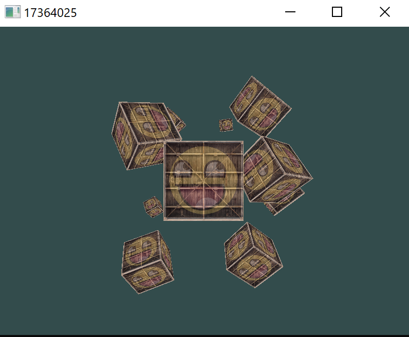
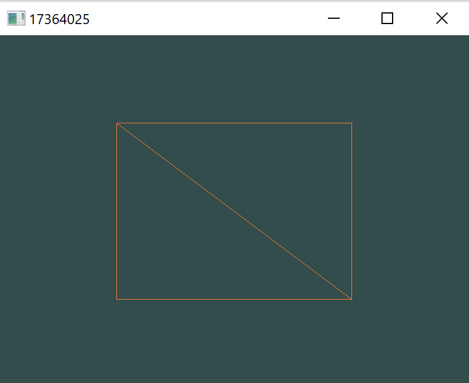

# Assignment 0: Introduction to OpenGL

17364025 贺恩泽

## Task 1

什么是 OpenGL？OpenGL 与计算机图形学的关系是什么？

OpenGL 本身是由 Khronos 组织制定和维护的 API 规范，规定了一系列可以操作图形和图像的函数，不过一般认为 OpenGL 是一组 API。使用 OpenGL 这个 3D 图形库可以方便的应用计算机图形学的原理进行绘图、处理图形和图像。OpenGL 是计算机图形学的实践，而计算机图形学是 OpenGL 的实现原理。

## Task 2

完成了着色器章节之后，请修改顶点着色器让三角形上下颠倒。

在顶点着色器中将三角形上下颠倒，只需要将坐标 Y 相对于 X 轴镜像即可。

原来的顶点着色器主函数代码为：

```glsl
gl_Position = vec4(aPos.x, aPos.y, aPos.z, 1.0);
outColor = aColor;
```

只需要将 `aPos.y` 修改为 `-aPos.y`即可：

```glsl
#version 330 core
    
layout (location = 0) in vec3 aPos;
layout (location = 1) in vec3 aColor;
out vec3 outColor;

void main()
{
    gl_Position = vec4(aPos.x, -aPos.y, aPos.z, 1.0);
    outColor = aColor;
}
```

效果如下：


## Task 3

完成了纹理章节之后，尝试用不同的纹理环绕方式，设定一个从 0.0f 到 2.0f 范围内的（而不是原来的 0.0f 到 1.0f ）纹理坐标。试试看能不能在箱子的角落放置4个笑脸。记得一定要试试其它的环绕方式。简述原因并贴上结果。

将纹理的坐标设置为 `2.0f`：

```cpp
float vertices[] = {
    0.5f,  0.5f, 0.0f,   1.0f, 0.0f, 0.0f,   2.0f, 2.0f,
    0.5f, -0.5f, 0.0f,   0.0f, 1.0f, 0.0f,   2.0f, 0.0f,
    -0.5f, -0.5f, 0.0f,   0.0f, 0.0f, 1.0f,   0.0f, 0.0f,
    -0.5f,  0.5f, 0.0f,   1.0f, 1.0f, 0.0f,   0.0f, 2.0f
};
```

即可得到以下结果：


这是因为将纹理的坐标放大为原来的两倍，则纹理对应矩形的坐标则缩小到原来的1/2，因此实际上表现为单个纹理的长宽变为原来的1/2，经过`GL_REPEAT`填充之后就成功地在横纵方向各填充了两个纹理，效果便是在箱子的四角各放了一个笑脸。

尝试其他的环绕方案，`GL_MIRRORED_REPEAT` 镜像重复：

```cpp
glTexParameteri(GL_TEXTURE_2D, GL_TEXTURE_WRAP_S, GL_MIRRORED_REPEAT);
glTexParameteri(GL_TEXTURE_2D, GL_TEXTURE_WRAP_T, GL_MIRRORED_REPEAT);
```


可以看到纹理在横纵方向基于中线被镜像了，当然也可以只横向镜像：

```cpp
glTexParameteri(GL_TEXTURE_2D, GL_TEXTURE_WRAP_S, GL_MIRRORED_REPEAT);
glTexParameteri(GL_TEXTURE_2D, GL_TEXTURE_WRAP_T, GL_REPEAT);
```


## Task 4

完成了坐标系统章节之后，对GLM的projection函数中的FoV和aspect-ratio参数进行实验。 看能否搞懂它们是如何影响透视平截头体的。


`FoV` 影响影响透视平截头体平面视野的大小，越大则可以观察到的范围越大：

| 30°             | 45°             | 60°             | 75°             |
| ---------------- | ---------------- | ---------------- | ---------------- |
|  |  |  |  |

宽高比`aspect-ratio`则影响透视平截头体平面的比例，会将图像按照比例进行整体缩放：

| 2:1                 | 16:9                 | 3:2                 | 4:3                 |
| ------------------- | -------------------- | ------------------- | ------------------- |
|  |  |  |  |

## Task 5

请按照顺序将跟着教程实现的运行结果贴出来，要求将运行出来的窗口的标题改成自己的学 号。(Tip: `glfwCreateWindow` 函数）

#### 绘制窗口


#### 绘制三角形


#### 绘制矩形




#### 绘制渐变三角形


#### 添加纹理


#### 彩色纹理


#### 纹理覆盖


#### 平面变换


#### 透视变换


#### Z 缓冲


#### 多立方体


#### 摄像机——绕轴旋转


#### 摄像机——自由视角移动

