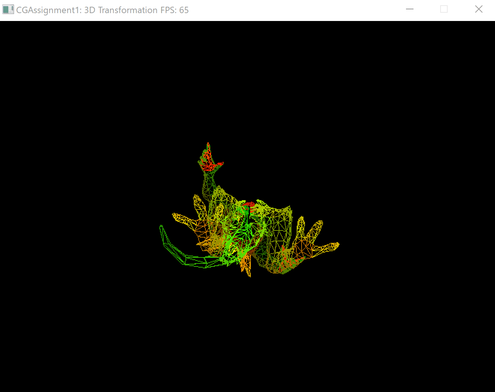
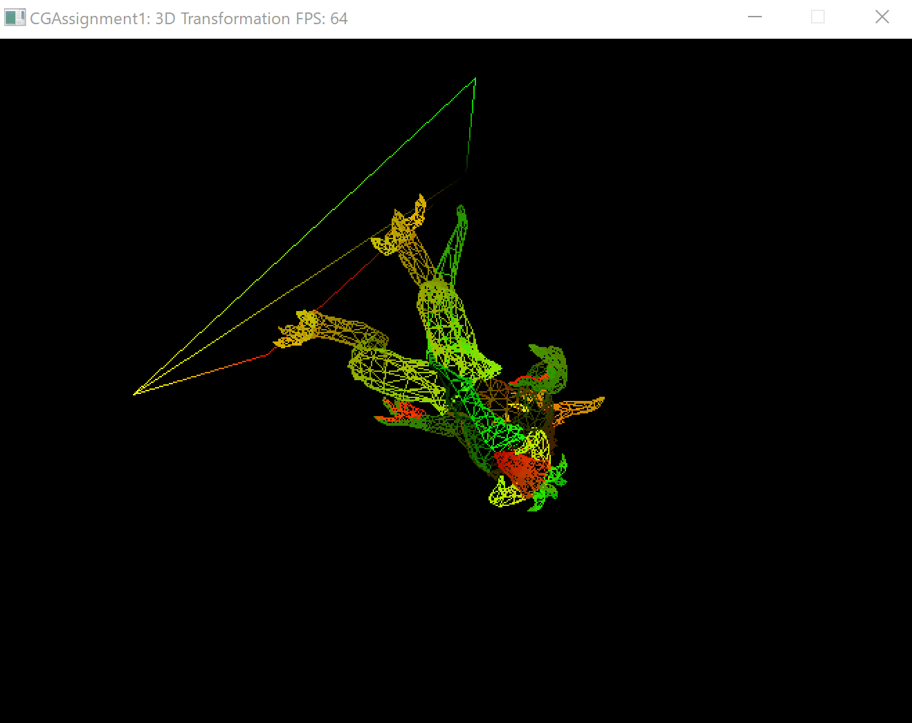
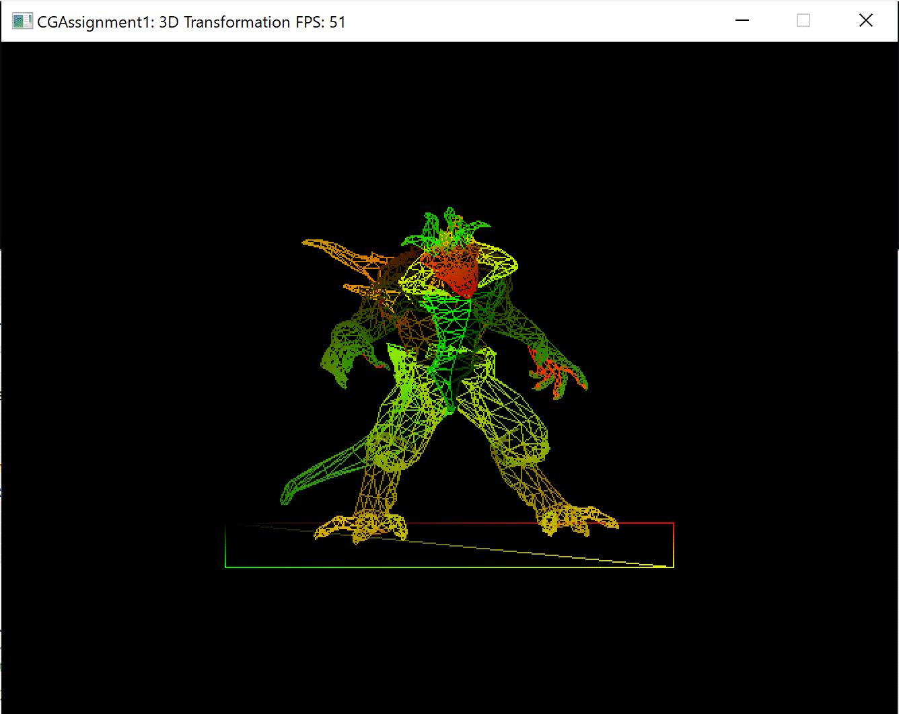
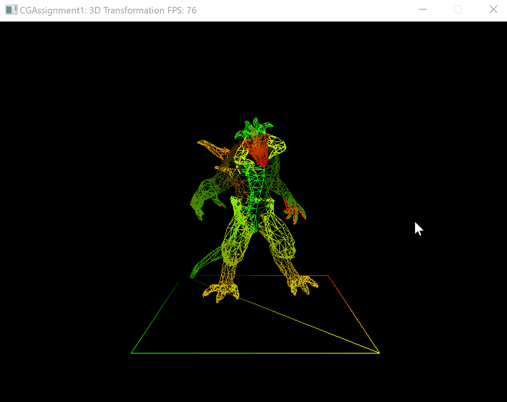
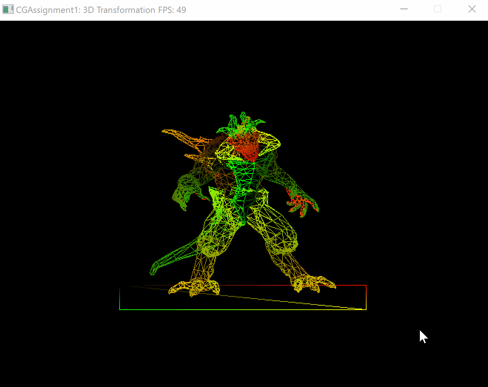

# Assignment 1: 3D Transformation

2018 级软件工程 17364025 贺恩泽

## Task 1
实现观察矩阵（View Matrix）的计算。

观察矩阵可以将世界坐标系转换成观察坐标系。在 OpenGL 中没有摄像机的概念，因此可以通过把场景中的所有物体往反方向移动的方式来模拟摄像机。

首先，用物体的位置减去摄像机的位置得到摄像机的指向向量，然后将结果归一化：

```cpp
glm::vec3 z = glm::normalize(target - camera);
```

然后可以将摄像机方向向量与世界的上方向向量叉乘得到右向量：

```cpp
glm::vec3 x = glm::normalize(glm::cross(z, worldUp));
```

现在有了 `x` 和 `z` 向量，最后计算出指向摄像机的正 `y` 轴向量：

```cpp
glm::vec3 y = glm::cross(x, z);
```

得到三个向量之后，即可计算观察矩阵。

先将摄像机移动到原点然后做变换即可：

$$ M_{\text{view}}=R_{\text{view}} T_{\text{view}} = \begin{bmatrix} x_x & x_y & x_z & -\vec{X} \cdot E \\ y_x & y_y & y_z & -\vec{Y} \cdot E \\ z_x & z_y & z_z & -\vec{Z} \cdot E \\ 0 & 0 & 0 & 1 \end{bmatrix} $$

由于此处需要将 `-z` 带入，因此最后代码为：

```cpp
vMat[0][0] = x.x;
vMat[1][0] = x.y;
vMat[2][0] = x.z;
vMat[3][0] = -glm::dot(x, camera);

vMat[0][1] = y.x;
vMat[1][1] = y.y;
vMat[2][1] = y.z;
vMat[3][1] = -glm::dot(y, camera);

vMat[0][2] = -z.x;
vMat[1][2] = -z.y;
vMat[2][2] = -z.z;
vMat[3][2] = glm::dot(z, camera);

vMat[0][3] = 0;
vMat[1][3] = 0;
vMat[2][3] = 0;
vMat[3][3] = 1;
```

## Task 2
实现透视投影矩阵（Project Matrix）的计算。

透视投影通过透视矩阵乘法和透视除法完成。

首先计算 1/2 视角的正切值：

```cpp
float t = std::tan(fovy / 2);
```

然后即可计算得到透视投影变换矩阵：

$$ M_{\text{persp}}=\begin{bmatrix}
    \frac{1}{aspect \times t} & 0 & 0 & 0 \\
    0 & \frac{1}{t} & 0 & 0 \\
    0 & 0 & -\frac{f+n}{f-n} & -\frac{2fn}{f-n} \\
    0 & 0 & -1 & 0
\end{bmatrix} $$

```cpp
pMat[0][0] = 1 / (aspect * t);
pMat[1][0] = 0;
pMat[2][0] = 0;
pMat[3][0] = 0;

pMat[0][1] = 0;
pMat[1][1] = 1 / t;
pMat[2][1] = 0;
pMat[3][1] = 0;

pMat[0][2] = 0;
pMat[1][2] = 0;
pMat[2][2] = -(far + near) / (far - near);
pMat[3][2] = -(2 * far * near) / (far - near);

pMat[0][3] = 0;
pMat[1][3] = 0;
pMat[2][3] = -1;
pMat[3][3] = 0;
```

## Task 3
实现视口变换矩阵（Viewport Matrix）的计算。

视口变换用于将物体转换到屏幕坐标系上，即将 $[-1, 1]^2$ 转换到 $[0, \text{width}]\times[0, \text{height}]$。

由于屏幕左上角为坐标原点，因此变换矩阵为：

$$ M_{\text{viewport}}=\begin{bmatrix}
    \frac{\text{width}}{2} & 0 & 0 & \frac{\text{width}}{2} \\
    0 & -\frac{\text{height}}{2} & 0 & \frac{\text{height}}{2} \\
    0 & 0 & 1 & 0 \\
    0 & 0 & 0 & 1
\end{bmatrix} $$

实现代码：

```cpp
vpMat[0][0] = width / 2.0f;
vpMat[1][0] = 0;
vpMat[2][0] = 0;
vpMat[3][0] = width / 2.0f;

vpMat[0][1] = 0;
vpMat[1][1] = -height / 2.0f;
vpMat[2][1] = 0;
vpMat[3][1] = height / 2.0f;

vpMat[0][2] = 0;
vpMat[1][2] = 0;
vpMat[2][2] = 1;
vpMat[3][2] = 0;

vpMat[0][3] = 0;
vpMat[1][3] = 0;
vpMat[2][3] = 0;
vpMat[3][3] = 1;
```

得到效果图（1.gif）：


## Task 4
使得物体分别绕 x 轴和 z 轴旋转。

只需要将旋转的 `axis` 分别设置为 $[1,0,0]$ 和 $[0,0,1]$ 即可。

```cpp
model_mat = glm::rotate(model_mat, (float)deltaTime * 0.001f, glm::vec3(1, 0, 0)); // 绕 X 轴旋转
model_mat = glm::rotate(model_mat, (float)deltaTime * 0.001f, glm::vec3(0, 0, 1)); // 绕 Z 轴旋转
```

效果如下（2.gif 和 3.gif）：





## Task 5
使物体不停地放大、缩小、放大循环。

利用 `glm::scale` 可以将物体放大和缩小，如果调用 `glm::scale(model_mat, glm::vec3(a, b, c))` 则会将物体在 X、Y、Z 方向分别放大 a、b、c 倍。

因此利用这个性质，为了使物体逐渐放大和缩小，添加一个 `accumulatedScale` 变量用于记录目前已经放大的倍数。为了使放大缩小的速度和帧渲染的速度无关，利用 `deltaTime` 来决定放大的倍数。

设每次 1ms 放大倍数为 `scaleCoef`，则 `deltaTime` 后放大的倍数应该是 $\text{scaleCoef}^{\text{deltaTime}}$。

最后再利用一个布尔值 `scaleUp` 记录当前是使用 `scaleCoef` 放大还是使用 `1 / scaleCoef` 缩小即可:

```cpp
const float scaleCoef = 1.0002f;
const float scaleUpTo = 2;
float accumulatedScale = 1;
bool scaleUp = true;

while (!winApp->shouldWindowClose())
{
	// ...

	float coef = 1;

	// 是否放大
	if (scaleUp) {
		coef = std::powf(scaleCoef, (float)deltaTime);
		accumulatedScale *= coef;
		// 如果放大倍数超出了则调整本次倍数到正好 2 倍
		if (accumulatedScale >= scaleUpTo) {
			scaleUp = false;
			coef /= accumulatedScale / scaleUpTo;
		}
	}
	else {
		coef = std::powf(1 / scaleCoef, (float)deltaTime);
		accumulatedScale *= coef;
		// 如果缩小倍数超出了则调整本次倍数到正好 1 倍
		if (accumulatedScale <= 1) {
			scaleUp = true;
			coef /= accumulatedScale;
		}
	}

	// 进行缩放
	model_mat = glm::scale(model_mat, glm::vec3(coef, coef, coef));
}
```

最后得到的效果如下（4.gif）：


## Task 6
实现正交投影矩阵的计算。

正交投影中，只需要先将中心移动到原点，然后缩放即可：

$$ M_\text{ortho}=\begin{bmatrix}
    \frac{2}{r-l} & 0 & 0 & 0 \\
    0 & \frac{2}{t-b} & 0 & 0 \\
    0 & 0 & \frac{2}{n-f} & 0 \\
    0 & 0 & 0 & 1
\end{bmatrix} \begin{bmatrix}
    1 & 0 & 0 & -\frac{r+l}{2} \\
    0 & 1 & 0 & -\frac{t+b}{2} \\
    0 & 0 & 1 & -\frac{n+f}{2} \\
    0 & 0 & 0 & 1 \\
\end{bmatrix} $$

计算后得到相应代码（n 和 f 需要分别代入 `-near` 和 `-far`）：

```cpp
pMat[0][0] = 2 / (right - left);
pMat[1][0] = 0;
pMat[2][0] = 0;
pMat[3][0] = -(right + left) / (right - left);

pMat[0][1] = 0;
pMat[1][1] = 2 / (top - bottom);
pMat[2][1] = 0;
pMat[3][1] = -(top + bottom) / (top - bottom);

pMat[0][2] = 0;
pMat[1][2] = 0;
pMat[2][2] = -2 / (far - near);
pMat[3][2] = -(far + near) / (far - near);

pMat[0][3] = 0;
pMat[1][3] = 0;
pMat[2][3] = 0;
pMat[3][3] = 1;
```

最后得到效果（5.gif）：



## Task 7
分别尝试调用透视投影和正交投影函数，通过滚动鼠标的滚轮来拉近或拉远摄像机的位置，体会透视投影和正交投影的差别。

透视投影拉近拉远（6.gif）：



正交投影拉近拉远（7.gif）：



可以发现，正交投影中，物体的大小不随着摄像机的远近而改变，而透视投影中则会随着摄像机的远近而缩小放大。

## Task 8
1. 请简述正交投影和透视投影的差别。
   
   透视投影将影像映射到摄像机和物体之间的一块透视版上，即以中心投影作透视；而正交投影则相当于用一束平行光照射物体，即将物体垂直投影到屏幕上。因此当摄像机与物体之间的距离发生变化时，透视投影会随着距离远近而缩小放大，而正交投影不会。
2. 从物体局部空间的顶点的顶点到最终的屏幕空间上的顶点，需要经历哪几个空间的坐标系？裁剪空间下的顶点的 w 值是哪个空间坐标下的 z 值？它有什么空间意义？
   
   需要经过物体局部空间、世界空间、观察空间、裁剪空间和屏幕空间。
   
   裁剪空间下的顶点的 w 值是观察空间坐标下的 z 值（$w = -z$）。投影矩阵将 X、Y、Z 分量进行了不同程度的缩放，变换后的顶点在视锥体内则需满足 $x, y, z \in [-w, w]$。
   
3. 经过投影变换之后，几何顶点的坐标值是被直接变换到了 NDC 坐标（即 xyz 的值全部都在 [-1, 1] 范围内）吗？透视除法（Perspective Division）是什么？为什么要有这么一个过程？
   
   不是。投影变换先将坐标变换到剪裁空间，然后才变换到 NDC 坐标。
   
   在剪裁空间中，GPU 会将范围之外的顶点删除，然后再利用透视除法将顶点转换为 NDC 坐标。

   透视除法就是将剪裁空间顶点的四个分量都除以 w 分量。之所以要这么做，是因为在下面的变换矩阵中，只有当 w 为 1 时，三维坐标点和四维齐次坐标点才等价，因此在 w 不等于 1 时，需要使用透视除法让 w 等于 1。

   $$ \begin{bmatrix}
       x & y & z & w
   \end{bmatrix} \begin{bmatrix}
       1 & 0 & 0 & 0 \\
       0 & 1 & 0 & 0 \\
       0 & 0 & 1 & 0 \\
       \Delta x & \Delta y & \Delta z & 1
   \end{bmatrix} = \begin{bmatrix}
       x + \Delta x \cdot w & y + \Delta y \cdot w & z + \Delta z \cdot w
   \end{bmatrix} $$