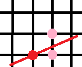
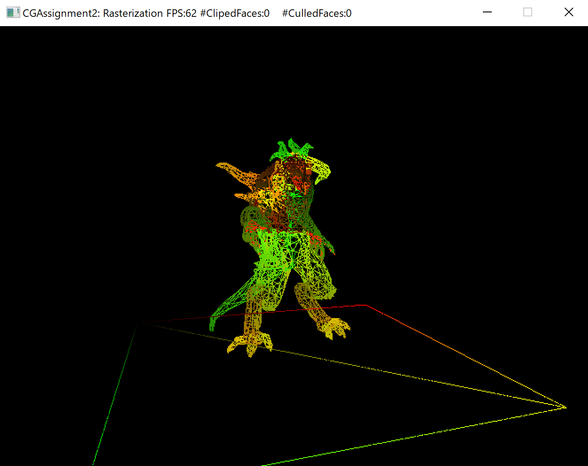
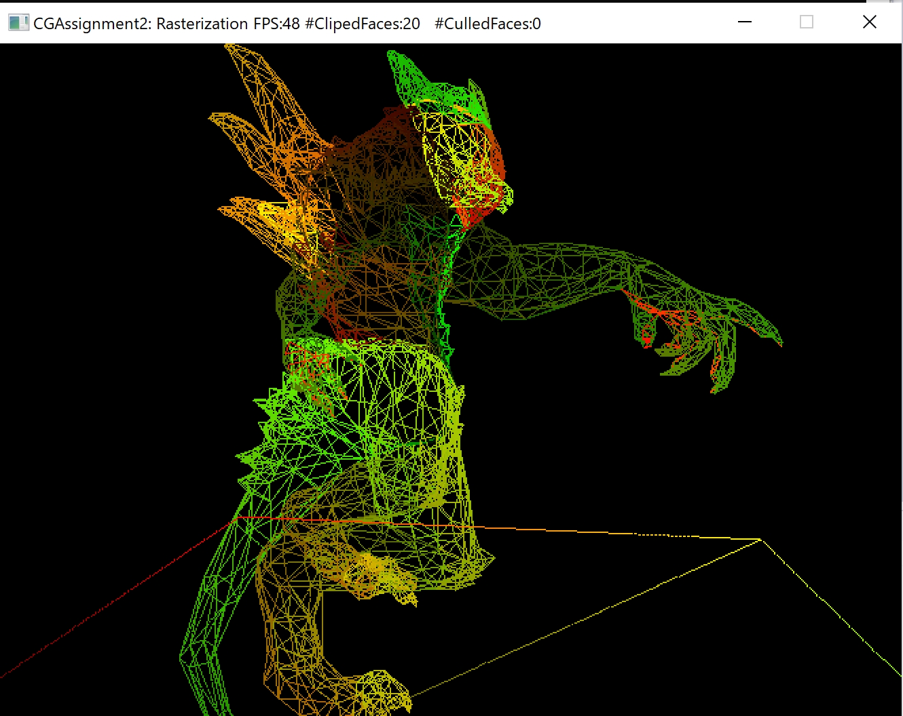
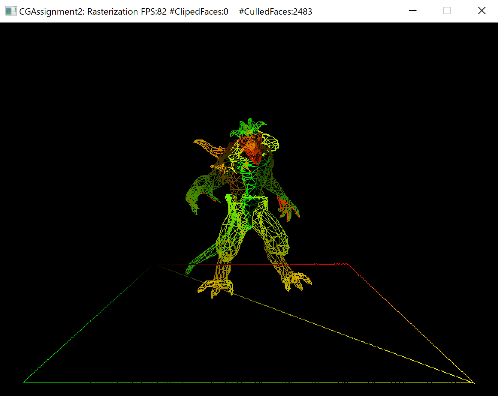
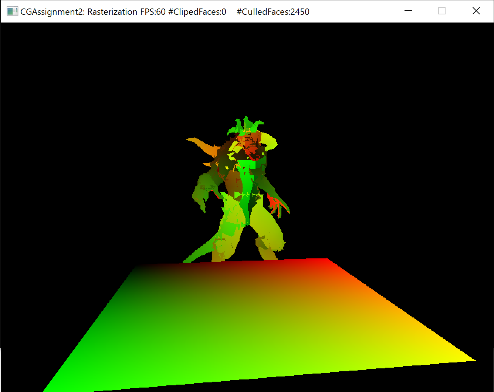
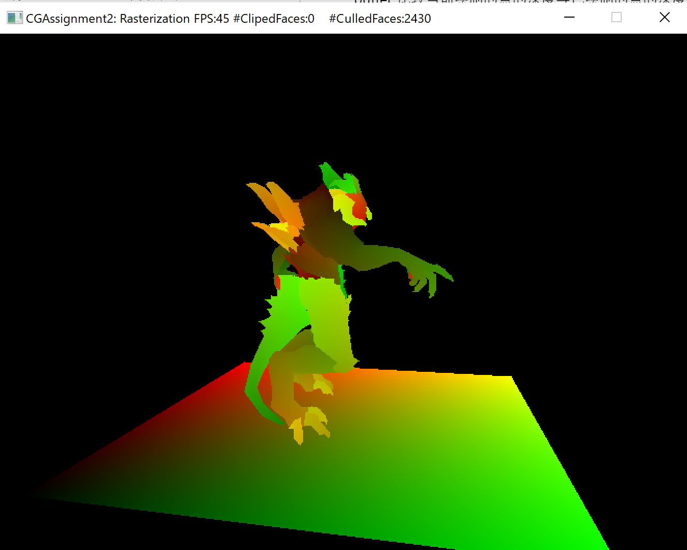
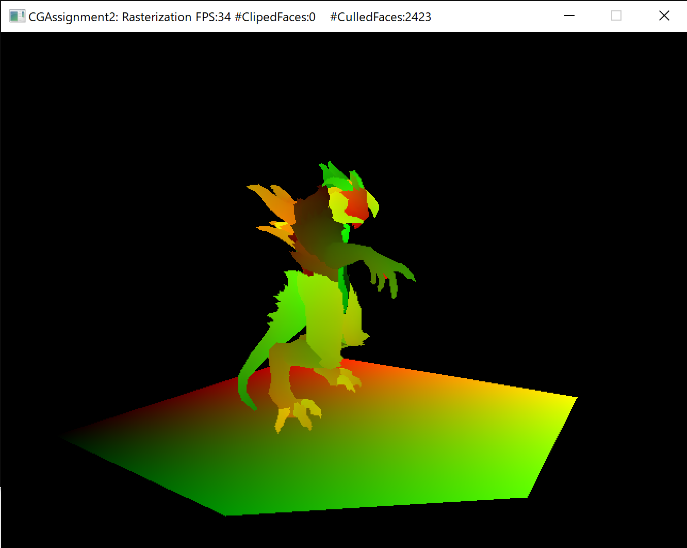

# Assignment 2: Rasterization & Z-buffering

17364025 贺恩泽

## Task 1: Bresenham 直线光栅化

Bresenham 描线算法可以用于描绘从 $(x_0,y_0)$ 到 $(x_1,y_1)$ 的一条线段。

该算法从起始点 $x=x_0$ 开始，每次将 $x$ 加 1，然后计算对应的 $y$，最后选择离该 $y$ 最近的一个点。

设直线表达式为 $y=kx+b$，则 $(x_{i+1},y_{i+1})$ 为：

$$ x_{i+1}=x_i+1 $$
$$ y_{i+1}=kx_{i+1}+b=k(x_i+1)+b $$

那么对于该 $y_{i+1}$，计算距离其上下像素点的距离如下：

$$ d_{up}=y_i+1-y_{i+1}=y_i+1-kx_{x+1}-b $$
$$ d_{lo}=y_{i+1}-y_i=kx_{x+1}+b-y_i $$



如果 $d_{lo}-d_{up}>0$，则选取上方的点，否则选取下方的点。

$$ d_{up}-d_{lo}=2k(x_i+1)-2y_i+2b-1 $$

由于计算 $k$ 需要利用浮点数除法计算，较为昂贵，因此需要消除除法。

由于 $k=\frac{\Delta{y}}{\Delta{x}}$，而 $\Delta{x}>0$，两边同时乘 $\Delta{x}$ 得到：

$$ p_i=\Delta{x}(d_{up}-d_{lo})=2\Delta{y} \times x_i-2\Delta{x} \times y_i + (2b-1)\Delta{x}+2\Delta{y} $$

于是可以利用 $p_i$ 的符号作为选取标准。

$$ p_{i+1}-p_i=2\Delta{y}-2\Delta{x}(y_{i+1}-y_i) $$

如果 $p_i<=0$，则 $y_{i+1}=y_i$，有 $p_{i+1}=p_i+2\Delta{y}$；如果 $p_1>0$，则  $y_{i+1}=y_i+1$，有 $p_{i+1}=p_i+2\Delta{y}-2\Delta{x}$。

以上是对于 $|k|<=1$ 的情况，对于 $|k|>1$ 的情况，只需要将 $x$、$y$ 交换即可。

因此根据上述算法可以实现如下算法：

```cpp
int dx = to.spos.x - from.spos.x, dy = to.spos.y - from.spos.y;
int stepX = 1, stepY = 1;

// 判断符号，决定增长方向
if (dx < 0) {
    stepX = -1;
    dx = -dx;
}

if (dy < 0) {
    stepY = -1;
    dy = -dy;
}

// 计算 2dx、2dy 和 2*(dy-dx)
int dx2 = dx << 1, dy2 = dy << 1;
int delta_d2 = dy2 - dx2;
int sx = from.spos.x, sy = from.spos.y;

// k <= 1
if (dy <= dx) {
    int p = dy2 - dx;
    for (int i = 0; i <= dx; i++) {
        // 插值
        auto tmp = VertexData::lerp(from, to, static_cast<double>(i) / dx);

        // 判断是否在屏幕内
        if (tmp.spos.x >= 0 && tmp.spos.x < screen_width
            && tmp.spos.y >= 0 && tmp.spos.y < screen_height) {
            rasterized_points.push_back(tmp);
        }

        sx += stepX;
        // 根据符号迭代 p
        if (p <= 0) {
            p += dy2;
        }
        else {
            sy += stepY;
            p += delta_d2;
        }
    }
}
// k > 1
else {
    int p = dx2 - dy;

    for (int i = 0; i <= dy; i++) {
        // 插值
        auto tmp = VertexData::lerp(from, to, static_cast<double>(i) / dy);

        // 判断是否在屏幕内
        if (tmp.spos.x >= 0 && tmp.spos.x < screen_width
            && tmp.spos.y >= 0 && tmp.spos.y < screen_height) {
            rasterized_points.push_back(tmp);
        }

        sy += stepY;
        // 根据符号迭代 p
        if (p <= 0) {
            p += dx2;
        }
        else {
            sx += stepX;
            p += delta_d2;
        }
    }
}
```

最后实现效果如下：



## Task 2: 简单齐次空间裁剪
简单齐次空间裁剪只需要判断三角形的三个顶点是否都在可见范围内即可，如果有任何一个点在可见范围之外则将该三角形移除。

```cpp
// 判断近面
if (v0.cpos.w < m_frustum_near_far.x && 
    v1.cpos.w < m_frustum_near_far.x && 
    v2.cpos.w < m_frustum_near_far.x) {
    return {};
}

// 判断远面
if (v0.cpos.w > m_frustum_near_far.y &&
    v1.cpos.w > m_frustum_near_far.y &&
    v2.cpos.w > m_frustum_near_far.y) {
    return {};
}

// 判断左面
if (v0.cpos.x < -v0.cpos.w &&
    v1.cpos.x < -v1.cpos.w &&
    v2.cpos.x < -v2.cpos.w) {
    return {};
}

// 判断右面
if (v0.cpos.x > v0.cpos.w &&
    v1.cpos.x > v1.cpos.w &&
    v2.cpos.x > v2.cpos.w) {
    return {};
}

// 判断上面
if (v0.cpos.y < -v0.cpos.w &&
    v1.cpos.y < -v1.cpos.w &&
    v2.cpos.y < -v2.cpos.w) {
    return {};
}

// 判断下面
if (v0.cpos.y > v0.cpos.w &&
    v1.cpos.y > v1.cpos.w &&
    v2.cpos.y > v2.cpos.w) {
    return {};
}

// 判断前面
if (v0.cpos.z < -v0.cpos.w &&
    v1.cpos.z < -v1.cpos.w &&
    v2.cpos.z < -v2.cpos.w) {
    return {};
}

// 判断后面
if (v0.cpos.z > v0.cpos.w &&
    v1.cpos.z > v1.cpos.w &&
    v2.cpos.z > v2.cpos.w) {
    return {};
}

return { v0, v1, v2 };
```

实现效果如下:



# Task 3: 三角形背向面剔除
判断一个三角形是否在背向面，只需要将视角方向与三角形法向做点乘，然后根据结果的正负性即可判断。

此处按照逆时针方向取三角形的法向，然后用视角方向 $(0,0,1)$ 与其做点乘，如果小于 0 则代表是背向面，返回 `true` 将其剔除：

```cpp
glm::vec3 l1 = v1 - v0, l2 = v2 - v1;
glm::vec3 view = glm::vec3(0, 0, 1);
glm::vec3 towards = glm::cross(l1, l2);
if (glm::dot(view, towards) < 0) {
    return true;
}

return false;
```

实现效果：



## Task 4: Edge-function 三角形填充
首先计算出三角形的包围盒，然后遍历像素点判断是否在三角形内部即可。

判断三角形是否在内部可以利用重心坐标来进行。

对于三角形 $ABC$ 内部的任意一点 $P$，可以将 $\vec{AP}$ 表示为 $u\vec{AB}+v\vec{AC}$。

因此可以得到：

$$ \begin{bmatrix}
    u & v & 1
\end{bmatrix}\begin{bmatrix}
    \vec{AB_x} \\ \vec{AC_x} \\ \vec{PA_x}
\end{bmatrix} = 0 $$

$$ \begin{bmatrix}
    u & v & 1
\end{bmatrix}\begin{bmatrix}
    \vec{AB_y} \\ \vec{AC_y} \\ \vec{PA_y}
\end{bmatrix} = 0 $$

于是，只需要将 $\begin{bmatrix}
    B_x-A_x & C_x-A_x & A_x - P_x
\end{bmatrix}$ 与 $\begin{bmatrix}
    B_y-A_y & C_y-A_y & A_y - P_y
\end{bmatrix}$ 做叉乘，即可得到 $u$。

最后，$P=\frac{1-u_x+u_y}{u_z}A+\frac{a}{c}B+\frac{b}{c}C,c\neq0$。

如果点在三角形内，则 $\frac{1-u_x+u_y}{u_z} \geq 0$，$\frac{a}{c} \geq 0$，且 $\frac{1-u_x+u_y}{u_z}+\frac{a}{c} \leq 1$。

```cpp
// 计算包围盒
int x_max = std::max({ v0.spos.x, v1.spos.x, v2.spos.x });
int y_max = std::max({ v0.spos.y, v1.spos.y, v2.spos.y });
int x_min = std::min({ v0.spos.x, v1.spos.x, v2.spos.x });
int y_min = std::min({ v0.spos.y, v1.spos.y, v2.spos.y });
// 遍历包围盒内每一点
for (int i = x_min; i <= x_max; i++) {
    for (int j = y_min; j <= y_max; j++) {
        glm::vec3 x = glm::vec3(v1.spos.x - v0.spos.x, v2.spos.x - v0.spos.x, v0.spos.x - i);
        glm::vec3 y = glm::vec3(v1.spos.y - v0.spos.y, v2.spos.y - v0.spos.y, v0.spos.y - j);
        glm::vec3 u = glm::cross(x, y);
        glm::vec3 w = { 1.0f - (u.x + u.y) / u.z, u.x / u.z, u.y / u.z };
        // 判断是否在三角形内
        if (w.x >= 0 && w.y >= 0 && w.x + w.y <= 1) {
            // 插值
            VertexData interploated = VertexData::barycentricLerp(v0, v1, v2, w);
            // 修正误差
            interploated.spos.x = i, interploated.spos.y = j;
            rasterized_points.push_back(interploated);
        }
    }
}
```

最后实现效果：



## Task 5: 深度测试

实现深度测试，即可让远处的物体不盖住近处的物体，只需要利用 Z-buffer 比较当前绘制的点的深度与已绘制的点的深度即可：

```cpp
// 如果更远则跳过
if (m_backBuffer->readDepth(points.spos.x, points.spos.y) < points.cpos.z) continue;
```

实现效果：



## Task 6: 体会
直线光栅化将三角形的三点连成一条直线，而三角形填充光栅化则将整个三角形填充颜色。

利用齐次空间简单裁剪和背面剔除可以通过不渲染不可视的物体提升渲染效率。

在手工实现这些算法的过程中，我对渲染管线中如何从顶点到渲染成品的过程更加熟悉了。当然，在期间我也遇到了不少问题，例如：

- 一些数学和法向向量的推导较为麻烦，需要细心不出错
- 参考资料与所要实现的右手系坐标不同，需要进行转换
- 重心坐标的计算和各分量的关系的理解
- ......

上述任何一个环节出错，渲染出来的图形便会出现问题。

不过，最终成功解决了各种问题，图形便被成功的渲染了出来，收获良多。

## Task 7: 更精细的齐次空间三角形裁剪
简单齐次空间裁剪对于任何一个只要出可视范围外的三角形便直接去掉，这样会使得距离可视范围较近的部分三角形被剔除，导致渲染出来的图形有所残缺。

因此需要实现更精细的齐次空间三角形裁剪。

在这种裁剪方式下，会对上下左右前后六个面分别进行裁剪，如果有三角形与面相交，不应该直接删除该三角形，而应该计算出交线然后删除掉交线以外的部分。

这个裁剪需要在 NDC 空间下完成。

给定任意一点 $Q$，和一个由点 $P$ 和发现 $\vec{n}$ 决定的平面，如果 $d=(Q-P)\cdot \vec{n}>0$，则 $Q$ 在平面外侧；如果 $d=(Q-P)\cdot \vec{n}=0$，则 $Q$ 在平面上；否则在平面内侧。

因此根据这个关系，给定任意一条线段 $\vec{Q_1Q_2}$，只需要分别计算 $d_1$ 和 $d_2$，判断两者是否异号，则可得到该直线是否与平面相交。

如果相交，则可进一步利用插值得到交点 $I$，作为三角新的新的点。

$$ I=Q_1+t(Q_2-Q_1) $$

其中，$t=\frac{Q_1I}{Q_1Q_2}=\frac{d_1}{d_1-d_2}$。

定义裁剪面结构：

```cpp
struct clip_plane {
	glm::vec4 p; // 点
	glm::vec4 n; // 法线
};
```

然后实现裁剪算法：

```cpp
std::vector<TRShaderPipeline::VertexData> clip_with_plane(
clip_plane& c_plane,
std::vector<TRShaderPipeline::VertexData>& vs) {
    std::vector<TRShaderPipeline::VertexData> result;
    int size = vs.size();

    for (int i = 0; i < size; i++)
    {
    	auto &start = vs[(i - 1 + size) % size];
    	auto &end = vs[i];
    	float d1 = glm::dot(start.cpos / start.cpos.w - c_plane.p, c_plane.n);
    	float d2 = glm::dot(end.cpos / end.cpos.w - c_plane.p, c_plane.n);

    	if (d1 * d2 < 0) {
    		float t = d1 / (d1 - d2);
    		result.push_back(TRShaderPipeline::VertexData::lerp(start, end, t));
    	}

    	if (d2 < 0) {
    		result.push_back(end);
    	}
    }

    return result;
}
```

然后对每一个面都进行一次裁剪即可：

```cpp
std::vector<TRShaderPipeline::VertexData> clipped = std::vector<TRShaderPipeline::VertexData>({ v0, v1, v2 });

clipped = clip_with_plane(clip_plane({ glm::vec4(0, 0, 0, 1), glm::vec4(0, std::cosf(M_PI / 4.0f), -std::sinf(M_PI / 4.0f), 0) }), clipped);
clipped = clip_with_plane(clip_plane({ glm::vec4(0, 0, 0, 1), glm::vec4(0, -std::cosf(M_PI / 4.0f), -std::sinf(M_PI / 4.0f), 0) }), clipped);
clipped = clip_with_plane(clip_plane({ glm::vec4(0, 0, 0, 1), glm::vec4(-std::cosf(M_PI / 4.0f), 0, -std::sinf(M_PI / 4.0f), 0) }), clipped);
clipped = clip_with_plane(clip_plane({ glm::vec4(0, 0, 0, 1), glm::vec4(std::cosf(M_PI / 4.0f), 0, -std::sinf(M_PI / 4.0f), 0) }), clipped);
clipped = clip_with_plane(clip_plane({ glm::vec4(0, 0, m_frustum_near_far.x, 1), glm::vec4(0, 0, -1, 0) }), clipped);
clipped = clip_with_plane(clip_plane({ glm::vec4(0, 0, m_frustum_near_far.y, 1), glm::vec4(0, 0, 1, 0) }), clipped);

return clipped;
```

最后效果如下：


