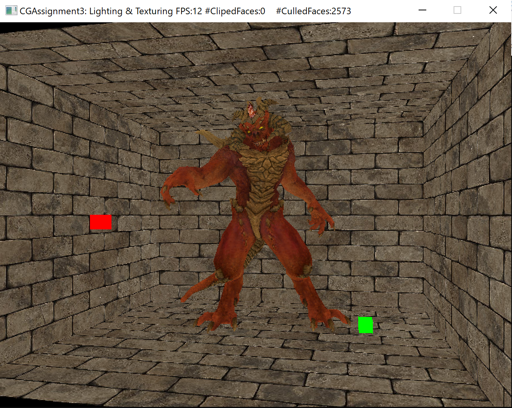
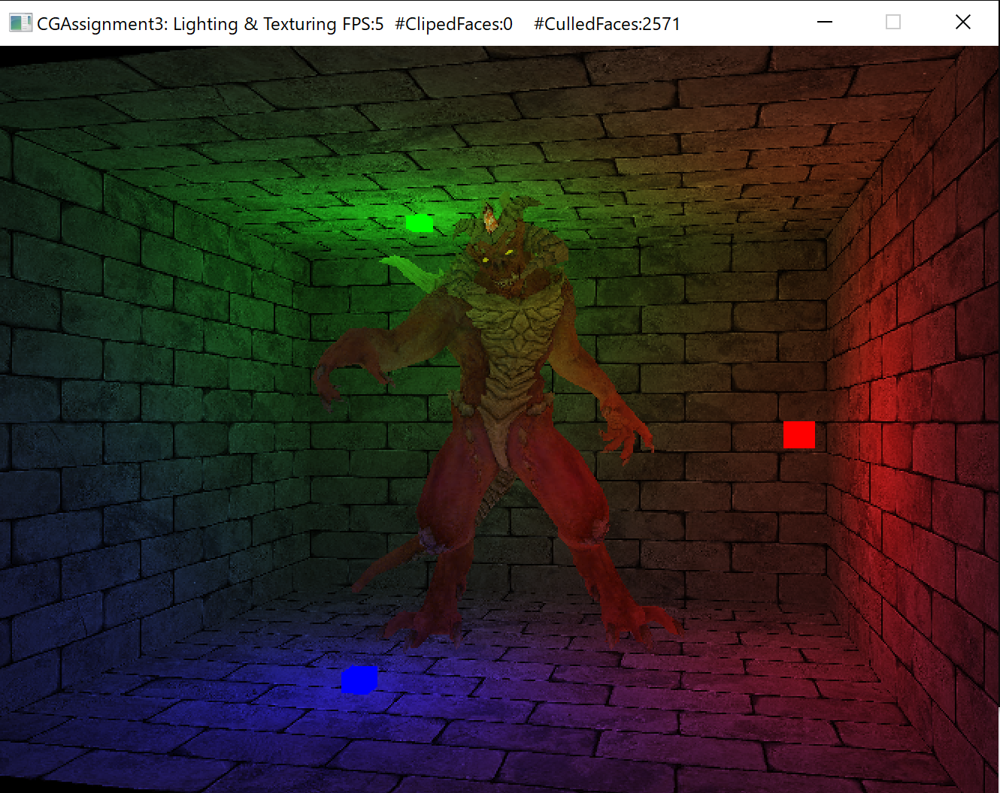
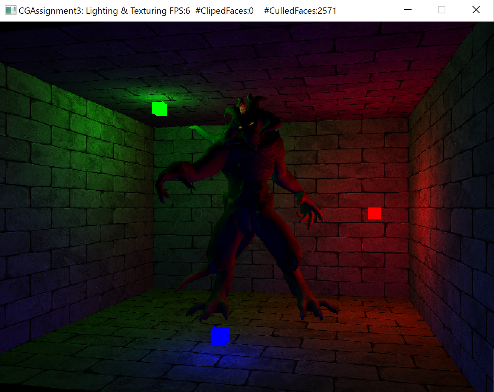
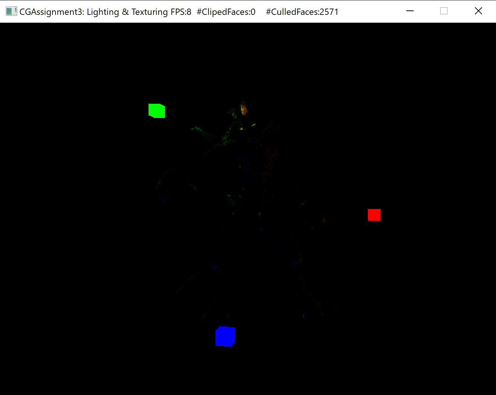
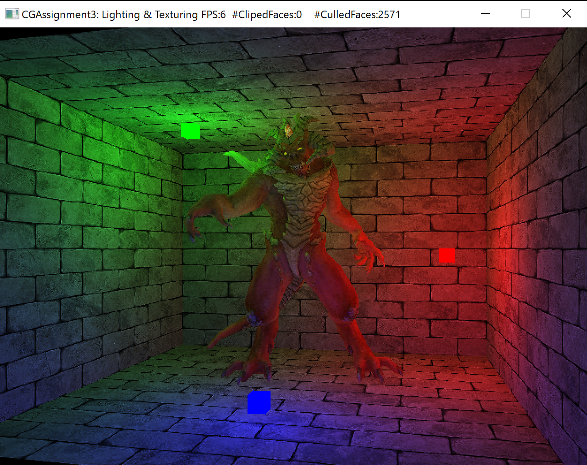
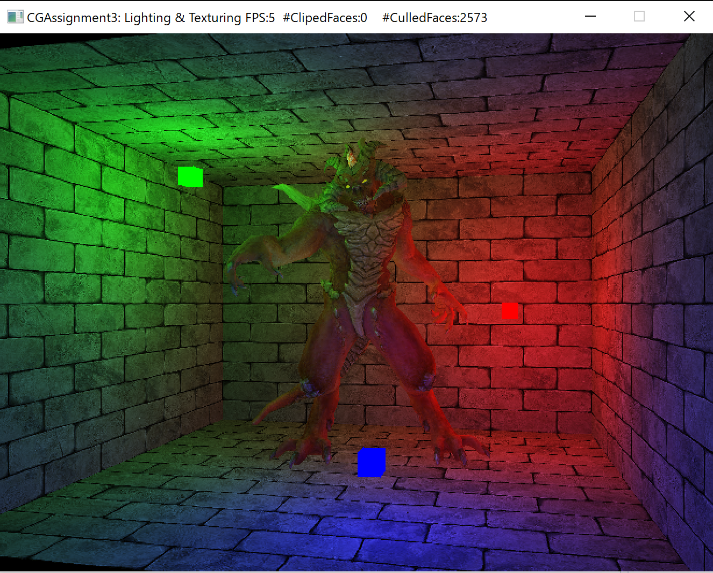
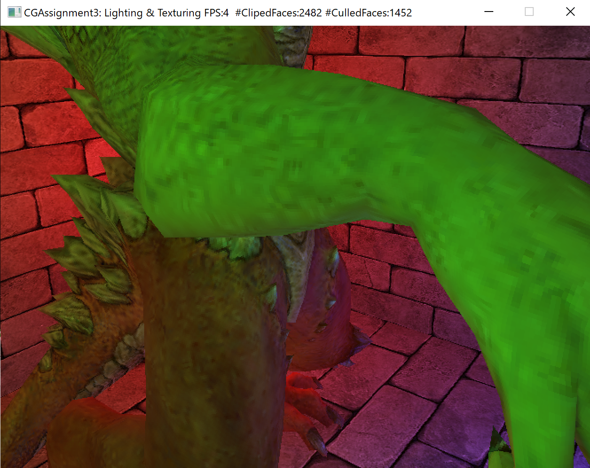
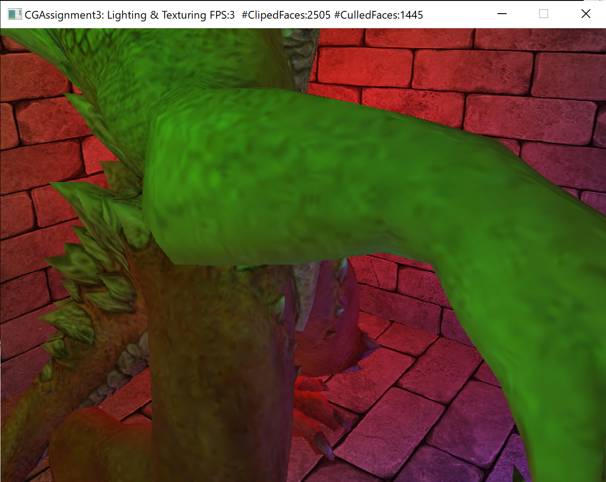
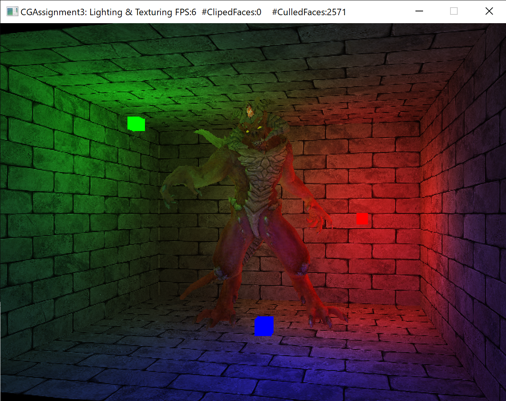
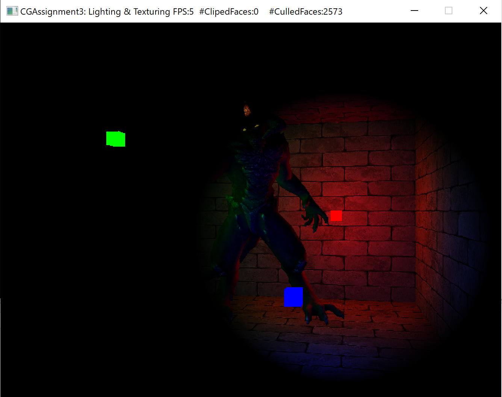

# Assignment 3: Lighting & Texturing
贺恩泽 17364025

## Task 1：实现纹理的最邻近采样算法

最邻近采样算法采用四舍五入方法来取 (u, v) 坐标对应的颜色值，因此只需要先将坐标从 $[0,1]\times[0,1]$ 映射到 $[0,\text{width}-1]\times[0, \text{height}-1]$ 后进行四舍五入即可。

```cpp
float x = uv.x * texture.m_width, y = uv.y * texture.m_height;
texture.readPixel(
    (int)std::floorf(x + 0.5), (int)std::floorf(y + 0.5), r, g, b, a);
```

实现效果如下：



## Task 2：实现 Phong 光照模型

Phong 光照模型的数学表达式如下：

$$ I = I_aK_a+I_pK_p(L \cdot N)+I_pK_s(R \cdot V)^n $$

光照的衰减可以通过如下公式得到：

$$ F_{att}=\frac{1.0}{K_c+K_l\times d + K_q \times d^2} $$

```cpp
// 漫反射参数 L·N
float diff = glm::max(glm::dot(normal, lightDir), 0.0f);
// 镜面反射参数 (R·V)^n
glm::vec3 reflectDir = glm::reflect(-lightDir, normal);
float spec = glm::pow(glm::max(glm::dot(viewDir, reflectDir), 0.0f), m_shininess);

// 计算衰减
float distance = glm::length(light.lightPos - fragPos);
attenuation = 1.0f / 
    (light.attenuation.x + light.attenuation.y * distance + 
        light.attenuation.z * distance * distance);

// 环境光分量
ambient = light.lightColor * amb_color;
// 漫反射分量
diffuse = light.lightColor * dif_color * diff;
// 镜面反射分量
specular = light.lightColor * spe_color * spec;
```

最后可以得到如下效果：

- 环境光

    

- 漫反射

    

- 镜面反射

    

- 全部

    

## Task 3：实现 Blinn-Phong 光照模型
Phong 的效果在反光度低的镜面反射发生时，会导致大片粗糙的高光区域断层，这是因为观察向量和反射向量之间的夹角如果大于 90° 则镜面分量会变成 0。

Blinn-Phong 模型不需要反射向量，而采用半程向量（光线与视线夹角一半方向的向量），这样只要光源不在表面以下，则半程向量和表面法线的夹角就不会超过 90°。

$$ \overline{H}=\frac{\overline{L}+\overline{V}}{||\overline{L}+\overline{V}||} $$

实现中，只需要修改计算镜面反射的参数代码即可：

```cpp
glm::vec3 halfwayDir = glm::normalize(lightDir + viewDir);
float spec = glm::pow(
    glm::max(glm::dot(normal, halfwayDir), 0.0f), 
    m_shininess);
```

实现效果：



## Task 4：双线性插值纹理过滤采样
使用双线性插值代替最小邻近纹理采样可以有效减少放大后的像素块状现象，将纹理变得更平滑。

双线性插值根据四个点，首先在 u 方向插值，然后接着在 v 方向插值。

设四个点分别是 $Q_{11}=(u_1, v_1)$、$Q_{12}=(u_1, v_2)$、$Q_{21}=(u_2, v_1)$ 和 $Q_{22}=(u_2, v_2)$。

在 u 方向插值：

$$ f(u,v_1)=(u_2-u)f(Q_{11})+(u-u_1)f(Q_{21}) $$
$$ f(u,v_2)=(u_2-u)f(Q_{12})+(u-u_1)f(Q_{22}) $$

然后再在 v 方向插值：

$$ f(u,v)=(v_2-v)f(u,v_1)+(v-v_1)f(u,v_2) $$

综合上式得到：

$$ f(u,v)=f(Q_{11})(u_2-u)(v_2-v) + f(Q_{21})(u-u_1)(v_2-v) \\ + f(Q_{12})(u_2-u)(v-v_2) + f(Q_{22})(u-u_1)(v-v_1) $$

代码实现：

```cpp
unsigned char r[4] = { 255,255,255,255 }, 
	g[4] = { 255,255,255,255 }, 
	b[4] = { 255,255,255,255 }, 
	a[4] = { 255,255,255,255 };

float x = uv.x * texture.m_width, 
    y = uv.y * texture.m_height;
int x1 = (int)std::floorf(x), x2 = (int)std::floorf(x + 1), 
    y1 = (int)std::floorf(y), y2 = (int)std::floorf(y + 1);

texture.readPixel(x1, y1, r[0], g[0], b[0], a[0]);
texture.readPixel(x1, y2, r[1], g[1], b[1], a[1]);
texture.readPixel(x2, y1, r[2], g[2], b[2], a[2]);
texture.readPixel(x2, y2, r[3], g[3], b[3], a[3]);

glm::vec4 q11 = glm::vec4(r[0], g[0], b[0], a[0]),
	q12 = glm::vec4(r[1], g[1], b[1], a[1]),
	q21 = glm::vec4(r[2], g[2], b[2], a[2]),
	q22 = glm::vec4(r[3], g[3], b[3], a[3]);

constexpr float denom = 1.0f / 255.0f;
glm::vec4 result = ((x2 - x) * (y2 - y) * q11 + (x - x1) * (y2 - y) * q21
	+ (x2 - x) * (y - y1) * q12 + (x - x1) * (y - y1) * q22) * denom;
```

最后实现效果：

- 最临近
  
    

- 双线性插值

    

## Task 5：实现聚光灯

聚光灯通过一个世界空间位置、一个方向和一个切角来表示，但是仅如此会导致聚光灯的边缘与外界区别很大，非常割裂，因此再增加一个外切角用来平滑边缘，这样就可以将内圆锥和外圆锥之间的部分进行渐变，这样聚光的边缘效果就会变得平滑。

首先在 `TRShadingState.h` 中添加聚光灯的数据结构 `TRSpotLight`：

```cpp
class TRSpotLight
{
public:
	glm::vec3 lightPos;
	glm::vec3 direction;
	float cutOff;
	float outerCutOff;

	TRSpotLight(glm::vec3 pos, glm::vec3 dir, float cutOff, float outerCutOff) 
		: lightPos(pos), direction(dir),  cutOff(cutOff), outerCutOff(outerCutOff) {}
};
```

然后编写函数用于新增聚光灯、获取聚光灯（下述代码省略对应的头文件声明）。

`TRShadingPipeline.cpp`:

```cpp
std::vector<TRSpotLight> TRShadingPipeline::m_spot_lights = {};

int TRShadingPipeline::addSpotLight(
        glm::vec3 pos, glm::vec3 dir, float cutOff, float outerCutOff)
{
	m_spot_lights.push_back(TRSpotLight(pos, dir, cutOff, outerCutOff));
	return m_spot_lights.size() - 1;
}

TRSpotLight& TRShadingPipeline::getSpotLight(int index)
{
	return m_spot_lights[index];
}
```

`TRRenderer.cpp`：

```cpp
int TRRenderer::addSpotLight(
    glm::vec3 pos, glm::vec3 dir, float cutOff, float outerCutOff)
{
	return TRShadingPipeline::addSpotLight(pos, dir, cutOff, outerCutOff);
}

TRSpotLight& TRRenderer::getSpotLight(const int& index)
{
	return TRShadingPipeline::getSpotLight(index);
}
```

最后实现聚光灯：对于每一个片段，如果位于聚光的内锥形之内则照亮，如果位于聚光的外圆锥之外则只保留环境光，否则根据位置取一个 0 到 1 之间的值用于渐变光照强度。

强度值 $I=\frac{\theta-\gamma}{\epsilon}$，$\epsilon$ 为内圆锥和外圆锥之间的余弦值之差。

```cpp
for (size_t s = 0; s < m_spot_lights.size(); ++s)
{
	const auto& light = m_spot_lights[s];
	glm::vec3 spotlightDir =
        glm::normalize(light.lightPos - fragPos);
    // 判断是否在聚光锥形之内
	float theta = glm::dot(spotlightDir, 
        glm::normalize(-light.direction));
	float epsilon = light.cutOff - light.outerCutOff;
    // 计算聚光强度
	float intensity = glm::clamp((theta - light.outerCutOff) / epsilon, 0.0f, 1.0f);

	for (size_t i = 0; i < m_point_lights.size(); ++i)
	{
		const auto& light = m_point_lights[i];
		glm::vec3 lightDir = glm::normalize(light.lightPos - fragPos);

		glm::vec3 ambient, diffuse, specular;
		float attenuation = 1.0f;

		{
			float diff = glm::max(glm::dot(normal, lightDir), 0.0f);
			glm::vec3 halfwayDir = glm::normalize(lightDir + viewDir);
			float spec = glm::pow(glm::max(glm::dot(normal, halfwayDir), 0.0f), m_shininess);

			float distance = glm::length(light.lightPos - fragPos);
			attenuation = 1.0f / 
                (light.attenuation.x + 
                light.attenuation.y * distance + 
                light.attenuation.z * distance * distance);

			ambient = light.lightColor * amb_color;
            // 为 Blinn-Phong 模型的漫反射和镜面反射乘上强度 I
			diffuse = light.lightColor * dif_color * diff * intensity;
			specular = light.lightColor * spe_color * spec * intensity;
		}

		fragColor.x += (ambient.x + diffuse.x + specular.x) * attenuation;
		fragColor.y += (ambient.y + diffuse.y + specular.y) * attenuation;
		fragColor.z += (ambient.z + diffuse.z + specular.z) * attenuation;
	}
}
```

最后使用一个聚光灯测试一下：

```cpp
renderer->addSpotLight(cameraPos, glm::vec3(-0.03f, -0.05f, -0.97f), glm::cos(glm::radians(12.5f)), glm::cos(glm::radians(17.5f)));
```

得到以下结果：



由于环境光较强因此难以看出来，因此将环境光设置为 0 后再看效果：



可以看到聚光灯的效果成功地被渲染了出来。