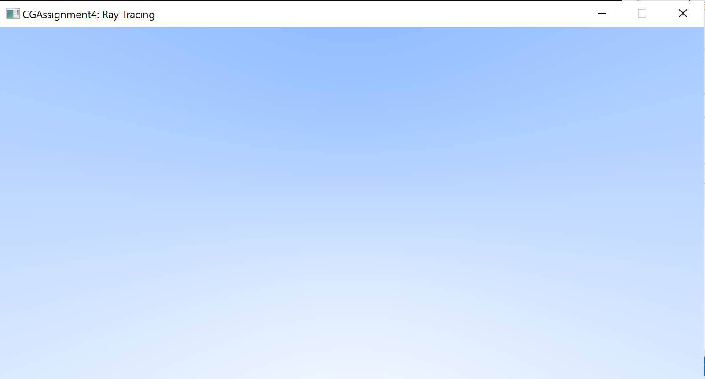

# Assignment 4: Ray Tracing
17364025 贺恩泽

## Task 1. 渲染渐变蓝色天空背景图

用参数方程表示光线：$p(t)=A+t*B$，其中，$A$ 是光源的位置，$B$ 是光线的方向。通过 $t$ 来让光线在直线上移动。

因此封装出 `ray` 类表示光线：

```cpp
class ray
{
public:
    ray() {}
    ray(const vec3& a, const vec3& b) : A(a), B(b) {}
    vec3 origin() const { return A; }
    vec3 direction() const { return B; }
    vec3 point(float t) const { return A + t * B; }

    vec3 A, B;
};
```

然后将相机放置在 $(0,0,0)$ 处，然后遍历屏幕上的点绘制颜色。由于屏幕大小是 400*800，因此用 $(-2,-1,-1)$ 表示空间中屏幕的左下角。

```cpp
vec3 lower_left_corner(-2.0f, -1.0f, -1.0f), 
    horizontal(4.0f, 0.0f, 0.0f), 
    vertical(0.0f, 2.0f, 0.0f), 
    origin(0.0f, 0.0f, 0.0f);

// The main ray-tracing based rendering loop
for (int j = ny - 1; j >= 0; j--)
{
    for (int i = 0; i < nx; i++)
    {
        float u = float(i) / float(nx);
        float v = float(j) / float(ny);
        ray r(origin, lower_left_corner + u * horizontal + v * vertical);
        vec3 col = color(r);
        int ir = 256 - int(255.99 * col[0]);
        int ig = 256 - int(255.99 * col[1]);
        int ib = 256 - int(255.99 * col[2]);

        writeRGBToCanvas(ir, ig, ib, i, j);
    }
}
```

最终得到如下效果：



遇到的问题：一开始渲染出的颜色是深橘黄色，与需要的颜色正好为反色。

解决方法：将 R、G、B 亮度值取反（用 256 减去对应颜色值）。

