# Assignment 4: Ray Tracing
17364025 贺恩泽

## Task 1. 渲染渐变蓝色天空背景图

用参数方程表示光线：$p(t)=A+t*B$，其中，$A$ 是光源的位置，$B$ 是光线的方向。通过 $t$ 来让光线在直线上移动。

因此封装出 `ray` 类表示光线：

```cpp
class ray
{
public:
    ray() {}
    ray(const vec3& a, const vec3& b) : A(a), B(b) {}
    vec3 origin() const { return A; }
    vec3 direction() const { return B; }
    vec3 point(float t) const { return A + t * B; }

    vec3 A, B;
};
```

然后将相机放置在 $(0,0,0)$ 处，然后遍历屏幕上的点绘制颜色。由于屏幕大小是 400*800，因此用 $(-2,-1,-1)$ 表示空间中屏幕的左下角。

```cpp
vec3 lower_left_corner(-2.0f, -1.0f, -1.0f), 
    horizontal(4.0f, 0.0f, 0.0f), 
    vertical(0.0f, 2.0f, 0.0f), 
    origin(0.0f, 0.0f, 0.0f);

// The main ray-tracing based rendering loop
for (int j = ny - 1; j >= 0; j--)
{
    for (int i = 0; i < nx; i++)
    {
        float u = float(i) / float(nx);
        float v = float(j) / float(ny);
        ray r(origin, lower_left_corner + u * horizontal + v * vertical);
        vec3 col = color(r);
        int ir = 256 - int(255.99 * col[0]);
        int ig = 256 - int(255.99 * col[1]);
        int ib = 256 - int(255.99 * col[2]);

        writeRGBToCanvas(ir, ig, ib, i, j);
    }
}
```

最终得到如下效果：


### 遇到的问题
一开始渲染出的颜色是深橘黄色，与需要的颜色正好为反色。

解决方法：将 R、G、B 亮度值取反（用 256 减去对应颜色值）。

## Task 2. 绘制简单的球形物体

为了绘制球形物体，首先需要一个函数用于检测光线是否经过了球体。

可以编写出如下代码：

```cpp
bool hit_sphere(const vec3& center, float radius) {
	vec3 oc = r.origin() - center;
	float a = dot(r.direction(), r.direction());
	float b = 2.0f * dot(oc, r.direction());
	float c = dot(oc, oc) - radius * radius;
	float discriminant = b * b - a * c * 4;
	return discriminant > 0;
}
```

然后在 `color` 函数中调用，如果在半径为 0.5（正则化后）的球内则返回红色：

```cpp
if (hit_sphere(vec3(0, 0, -1), 0.5, r))
    return vec3(1, 0, 0);
```

可以得到如下结果：

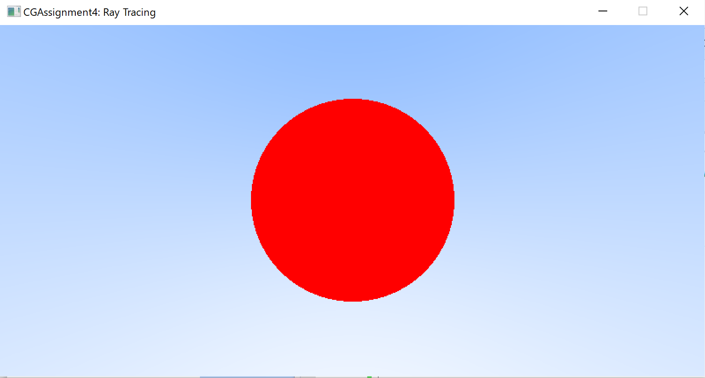

进一步改进 `hit_sphere` 球体求交函数，隐藏身后的物体，并且如果经过球体则求出碰撞（交点）的位置：

```cpp
if (discriminant < 0) return -1.0f;
return (-b - sqrt(discriminant)) / (2.0f * a);
```

然后绘制一个彩色球体：

```cpp
float t = hit_sphere(vec3(0, 0, -1), 0.5, r);
if (t > 0) {
    vec3 N = unit_vector(r.point(t) - vec3(0, 0, -1));
    return 0.5 * vec3(N.x() + 1, N.y() + 1, N.z() + 1);
}
```

最后做反走样处理：

```cpp
for (int j = ny - 1; j >= 0; j--)
{
    for (int i = 0; i < nx; i++)
    {
        vec3 col(0, 0, 0);
        for (int s = 0; s < ns; s++) {
            float u = float(i + drand48()) / float(nx);
            float v = float(j + drand48()) / float(ny);
            ray r = cam.get_ray(u, v);
            col += color(r, world);
        }
        col /= float(ns);
        int ir = 256 - int(255.99 * col[0]);
        int ig = 256 - int(255.99 * col[1]);
        int ib = 256 - int(255.99 * col[2]);

        writeRGBToCanvas(ir, ig, ib, i, j);
    }
}
```

得到最终的效果：

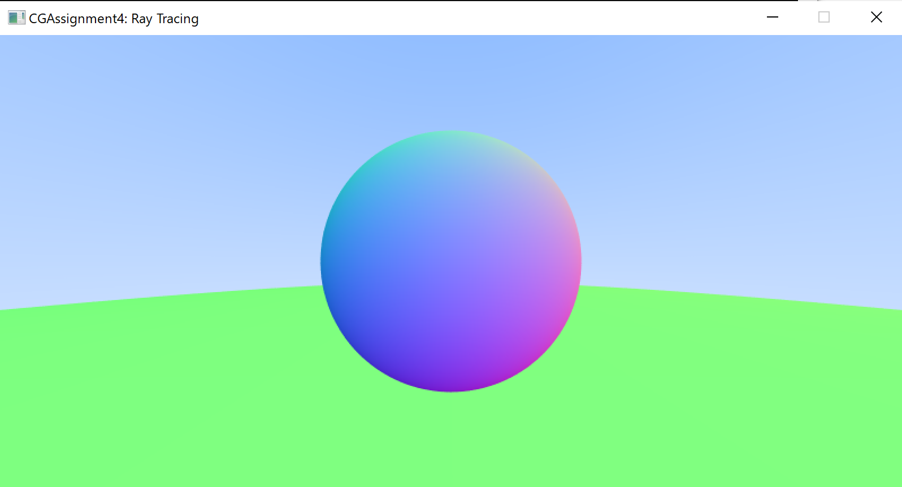

## Task 3. 添加材质
首先添加漫反射材质。

当光线撞到球体上点 $p$ 时，结合表面的法向量 $N$，然后在球体上随机选一点，将 $p$ 指向 $s$ 的射线作为反射光线即可。

```cpp
inline vec3 random_point() {
	vec3 p;

	do {
		p = 2.0 * vec3(drand48(), drand48(), drand48()) - vec3(1, 1, 1);
	} while (p.squared_length() >= 1.0);

	return p;
}
```

然后利用递归实现漫反射，每次递归吸收 50% 的能量：

```cpp
hit_record rec;
if (world->hit(r, 0.001, std::numeric_limits<float>::max(), rec)) {
    vec3 target = rec.p + rec.normal + random_point();
    return 0.f5 * color(ray(rec.p, target - rec.p), world);
}
```

最后 gamma 矫正后即可得到如下结果：

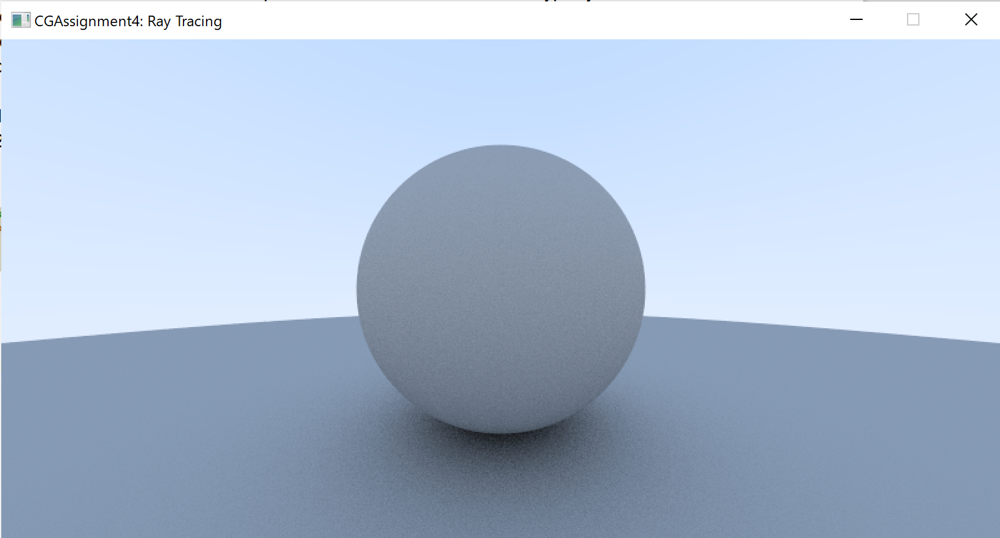

然后添加金属材质。

金属材质直接将入射光按照入射角反射：

```cpp
inline vec3 reflect(const vec3& v, const vec3& n) {
	return v - 2 * dot(v, n) * n;
}
```

追踪光线时，对光线和材质相交的点计算出出射光线，然后进行跟踪即可，过程中还需要计算出衰减等参数。

可以得到如下效果：

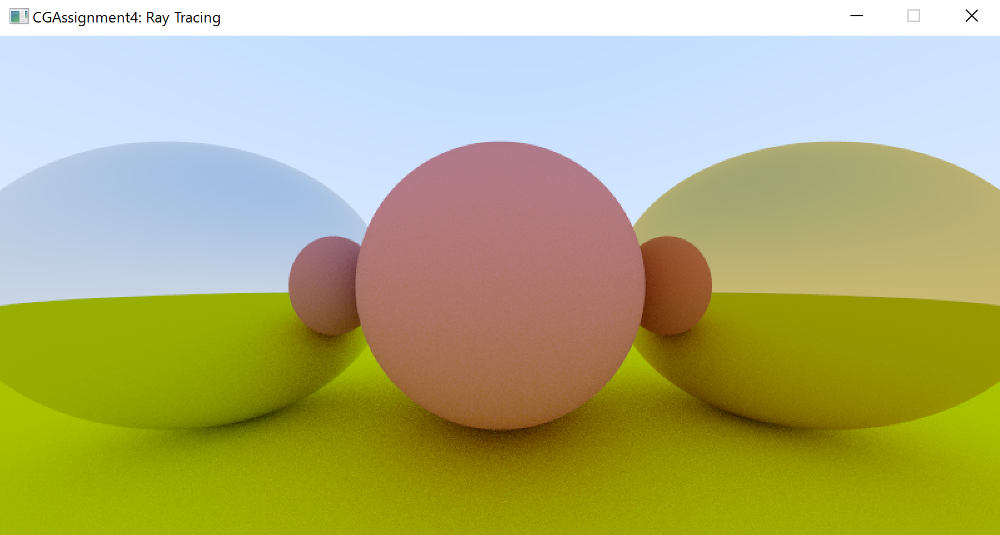

对于漫反射材质，对反射方向随机做出一些扰动，可以利用一个 `fuzz` 参数对扰动进行 0~1 的缩放。分别用 1.0（左） 和 0.3（右）可以得到如下效果：

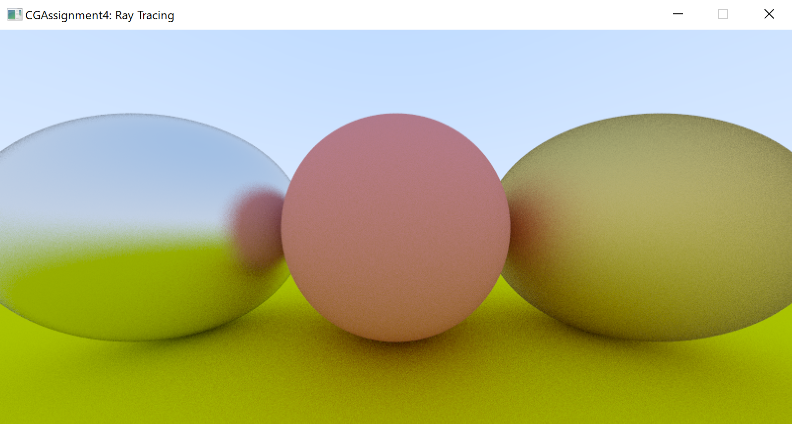

最后添加电解质材质。

电解质材质需要考虑折射，折射和材质的折射率有关，有：

$$ n\sin{\theta}={n'}\sin{\theta'} $$

得到如下实现：

```cpp
inline bool refract(const vec3& v, const vec3& n, 
    float ni_over_nt, vec3& refracted) {
	vec3 uv = unit_vector(v);
	float dt = dot(uv, n);
	float discriminant = 1.0f - ni_over_nt * ni_over_nt * (1 - dt * dt);
	if (discriminant > 0) {
		refracted = ni_over_nt * (uv - n * dt) - n * sqrt(discriminant);
		return true;
	}

	return false;
}
```

效果如下：

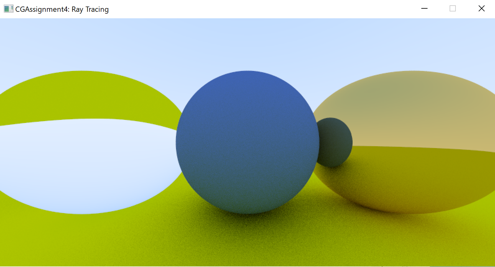

如果介质折射率较高，则可能会发生全反射，所以还需要计算出反射和折射光强的比重。由于利用物理公式求解十分复杂，这里通过如下方法估算：

```cpp
float schlick(float cosine, float ri) {
    float r0 = (1 - ri) / (1 + ri);
    r0 *= r0;
    return r0 + (1 - r0) * pow(1 - cosine, 5);
}
```

添加电解质材质，最终得到如下效果：

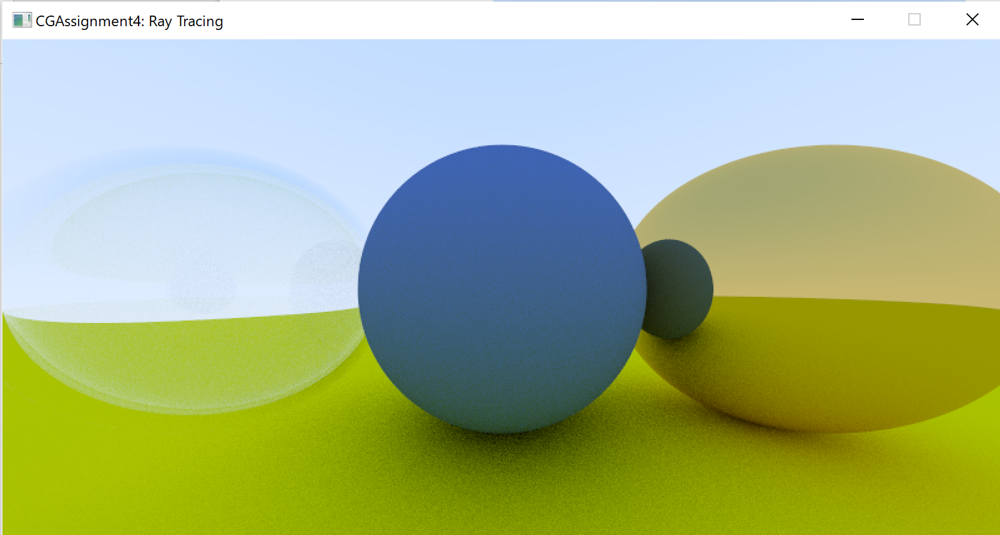

## Task 4. 摄像机聚焦和模糊

摄像机可以通过 `vfov` 和 `aspect` 两个参数分别表示视角（上下）和画面宽高比，然后利用如下方法计算出来，代入此前的 `lower_left_corner`、`horizontal` 和 `vertical` 参数即可。

```cpp
float theta = vfov * M_PI / 180;
float half_height = tan(theta / 2);
float half_width = aspect * half_height;
```

将物体分别放到 `(-cos(M_PI / 4), 0, -1)` 和 `cos(M_PI / 4, 0, -1)` 位置后，用 90 度的 `vfov` 测试一下：

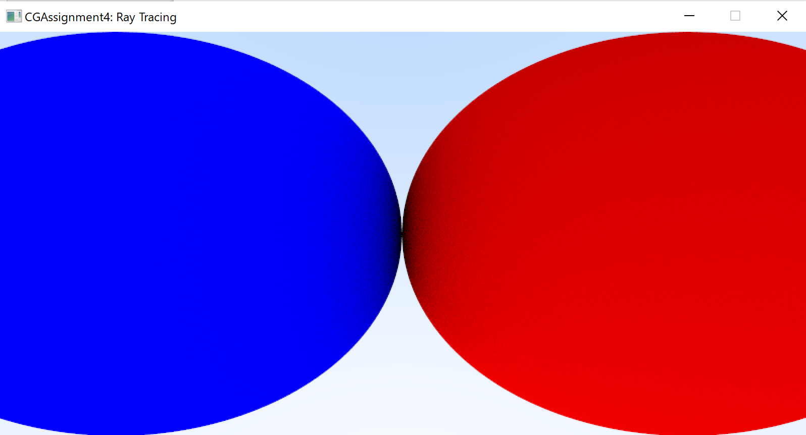

添加 `lookfrom` 和 `lookat` 表达视点和看向的点，将原点 `origin` 设为 `lookfrom`，再利用 `lookat` 和 `lookfrom` 计算出看向的向量，结合上方向向量 `vup`，最后得到上述的参数。

用 `lookfrom = (-2, 2, 1)`、`lookat = (0, 0, -1)`、`vup = (0, 1, 0)` 测试一下可得到如下效果：

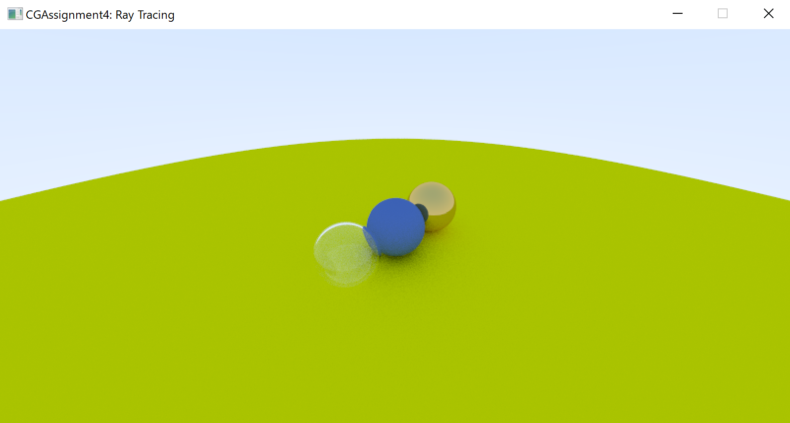

试着改变一下视角和位置，将 `lookfrom` 改为 `(-0.5, 0, 0)`，得到：

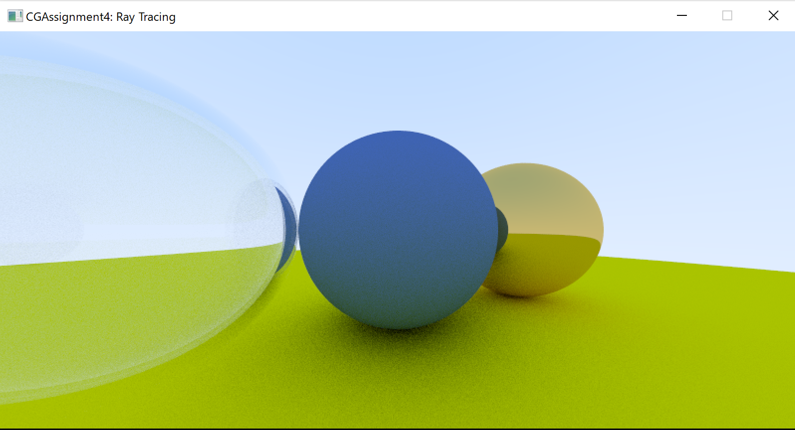

然后添加摄像机的聚焦和模糊效果。

这里不需要模拟真正的摄像机从传感器发送出光线射到镜头再聚焦的过程，可以直接从镜头发出光线射向焦平面（在距离 `focus_dist` 处），在这个平面上的所有东西都是完美聚焦的。

将摄像机换成 `lookfrom` 周围单位圆内的随机点模拟相机镜头，最后利用一个大光圈（2.0）测试得到效果如下：

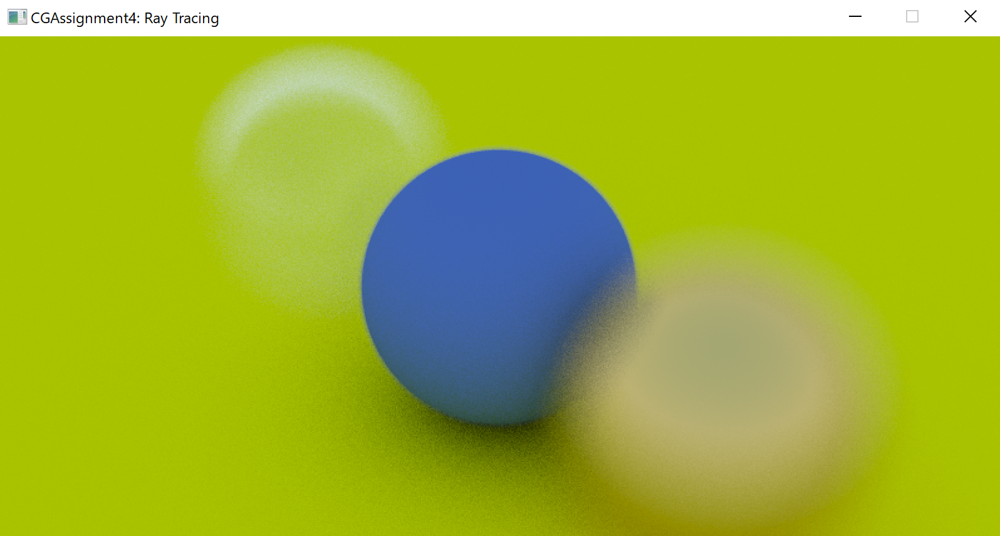

## Task 5. 渲染真实图片
在随机位置生成一系列的随机材质，再放三个球到场景中，得到如下结果：

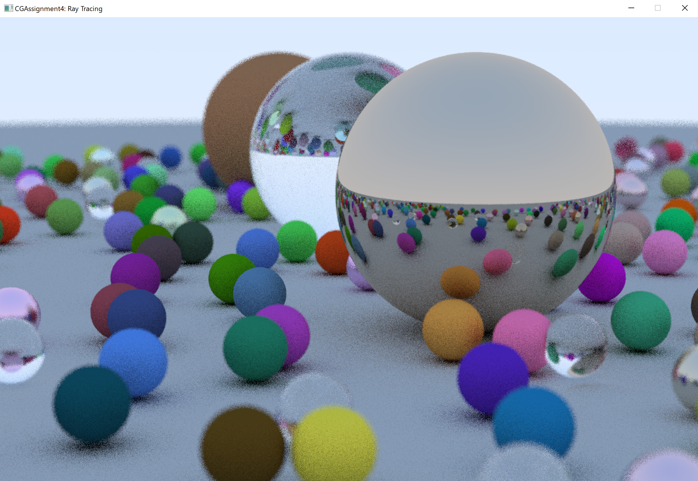

## Task 6. BVH 优化
利用 BVH 树可以加速射线和场景求交计算过程，如果射线没有和包围盒相交，则不需要考虑其中的物体，于是可以节省大量的运算。

这里利用 AABB 来划分，得到如下加速结果：

1. 无 BVH
   
   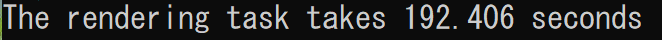
2. 有 BVH

   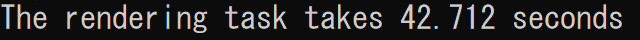

可以看到 192 秒被缩短到了 42 秒，加速效果非常明显。

## Task 7. 感想与收获
通过本次作业，我手动实践了上课中学到的光线追踪原理。

眼睛看到图像的原理是物体的光线进入眼睛，而光线追踪则反过来，通过摄像机向场景发出光线，然后求与物体碰撞的点得到此处的颜色，然后根据物体的材质反射或者折射，再接着追踪该光线最后渲染出场景。

上课时讲的光线追踪单从原理上来看涉及到了大量的计算，例如光线与物体的求交、反射和折射等等，先前以为会非常的复杂，但是实际实现下来却比想象中工作量要小很多。

另外，这次作业也让我对漫反射、金属和电解质材质的属性以及处理方法有了更深的理解。漫反射材质的反射光线具有随机的方向；金属则直接产生和表面法向量对称的反射光线；而电解质材质则还需要考虑折射的情况。

除了上面的东西，这次还实现了摄像机的聚焦和模糊，让我对摄像机的成像原理有了更深的理解。如果沿光路反过来说的话，传感器发出光线到镜头，然后聚焦到焦平面上。而在实际的实现当中，直接从镜头处发出随机光线而不是从传感器开始也打开了一种新的思路：没有必要按照现实中的实际情况去完全还原式地模拟。

最后，利用 BVH 树对光线追踪进行了加速，通过减少完全不相交的包围盒内光线和物体的相交计算，成功将时间缩短了 70% 以上。

此外，教程中对代码的封装方法也非常值得学习，利用多态将材质、物体等进行封装，以此最大限度地重用了代码，大大减少了代码的编写量，同时还提升了代码的扩展性。

总之，通过这次作业我收获到了非常多的东西。除了收获之外，看到写出的百来行代码最后真的渲染出了一张完整的光线追踪的场景图，也给我带来了不小的震撼和成就感。