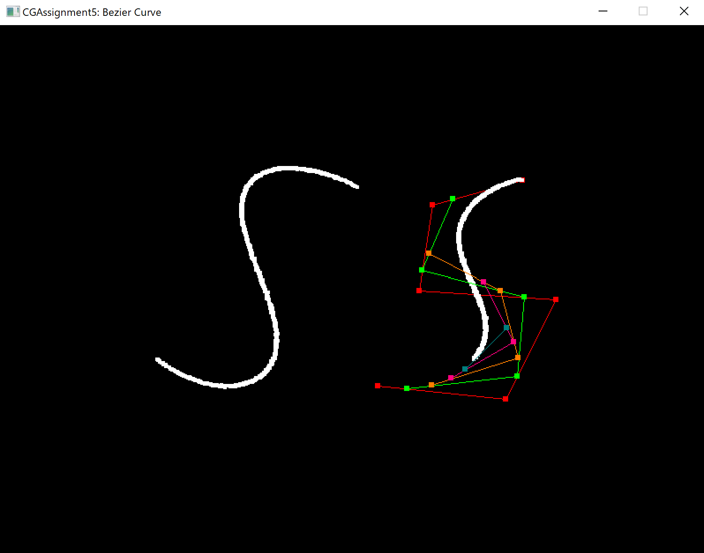
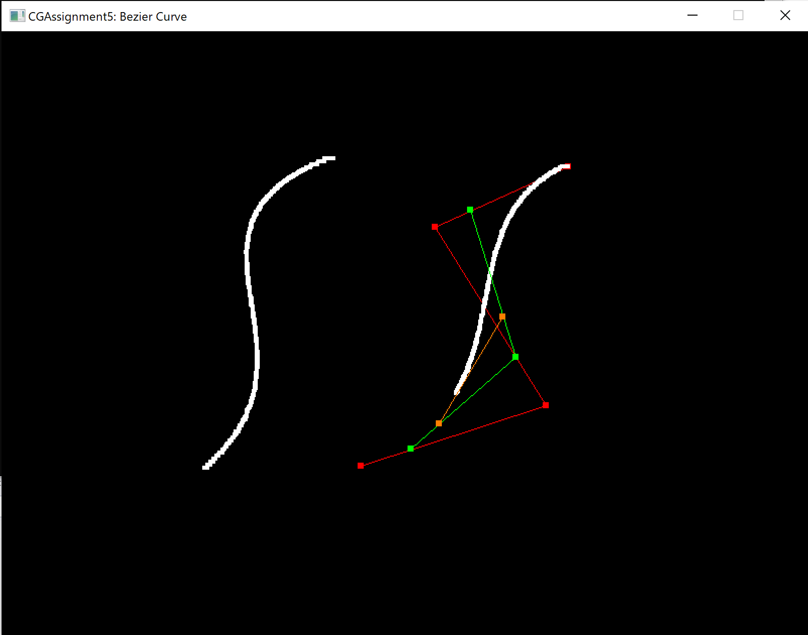

# Assignment 5: Bézier Curve
17364025 贺恩泽

## Task 1. 根据 Bézier 公式计算点

Bézier 曲线的定义公式如下：

$$ Q(t)=\sum_{i=0}^n{P_iB_{i,n}(t)},t\in [0,1] $$
$$ B_{i,n}(t)=\frac{n!}{i!(n-i)!}t^i(1-t)^(n-1),i=0,1,\cdots,n $$

因此，根据上述公式可以写出如下代码：

```cpp
int n = points.size() - 1;
auto p = Point2D(0, 0);
for (int i = 0; i <= n; i++)
{
    p += points[i] * getBezierValue(i, n, t);
}

return p;
```

其中，`getBezierValue` 函数实现上述 $B_{i,n}(t)$ 的计算。但是计算过程中的阶乘结果不必每次都重新计算，可以缓存下来到 `m_factorialValues` 中，后续计算如果用到直接调取缓存的结果。

```cpp
// 寻找缓存结果
int size = m_factorialValues.size() - 1;
if (n <= size) return m_factorialValues[n];

// 如果找不到则从已有缓存中最大的开始计算
int index = std::max(0, std::min(n, size));
long long result = m_factorialValues[index];

for (int i = index + 1; i <= n; i++)
{
    if (i <= size)
    {
        m_factorialValues[i] = result *= i;
    }
    else
    {
        m_factorialValues.push_back(result *= i);
    }
}

return result;
```

最后效果如下：



## Task 2. 采用 de Casteljau 算法计算点

该算法每次迭代时根据 `t` 值计算相邻两两控制点之间的插值结果作为新的控制点，重复迭代过程，直到剩下最后一个点，该点即为结果。

实现较为直观：

```cpp
std::vector<Point2D>* iter_points = new std::vector<Point2D>(points);

do 
{
    std::vector<Point2D>* temp = new std::vector<Point2D>({});
    int size = (*iter_points).size();
    // 计算相邻两两控制点之间关于 t 的插值结果
    for (int i = 0; i < size - 1; i++)
    {
        (*temp).push_back(Point2D::lerp((*iter_points)[i], (*iter_points)[i + 1], t));
    }

    delete iter_points;
    iter_points = temp;
}
while ((*iter_points).size() > 1);

// 返回最后一个点
Point2D result = (*iter_points)[0];
delete iter_points;

return result;
```

最后得到如下效果：



## Task3. 理解与总结

Bézier 曲线的特点是经过首尾控制点，并且与首尾控制点方向相同，即具有一阶导数性，利用该性质可以轻松的对 Bézier 曲线进行拼接，并确保 G1 连续。此外，Bézier 曲线一定在其控制点所围成的凸包内部。

从表达式来看，Bézier 曲线表达式的各项系数之和为 $1$，且具有对称性：即第 $i$ 项系数与倒数第 $i$ 项系数相同。

利用 $n$ 个控制点可以绘制出 $n-1$ 次的 Bézier 曲线，但是这样也会带来问题：当控制点增多时次数也随之升高，计算复杂度也随之增加，计算效率随之下降。

另外，Bézier 曲线具有全局性，对任何控制点的改变都将影响整条曲线，因此也难以对绘制好的线条进行局部调整。

Bézier 曲线的表达能力也有所欠缺，并不能画出所有类型的曲线。例如无法利用单条 Bézier 曲线绘制出一个圆。
