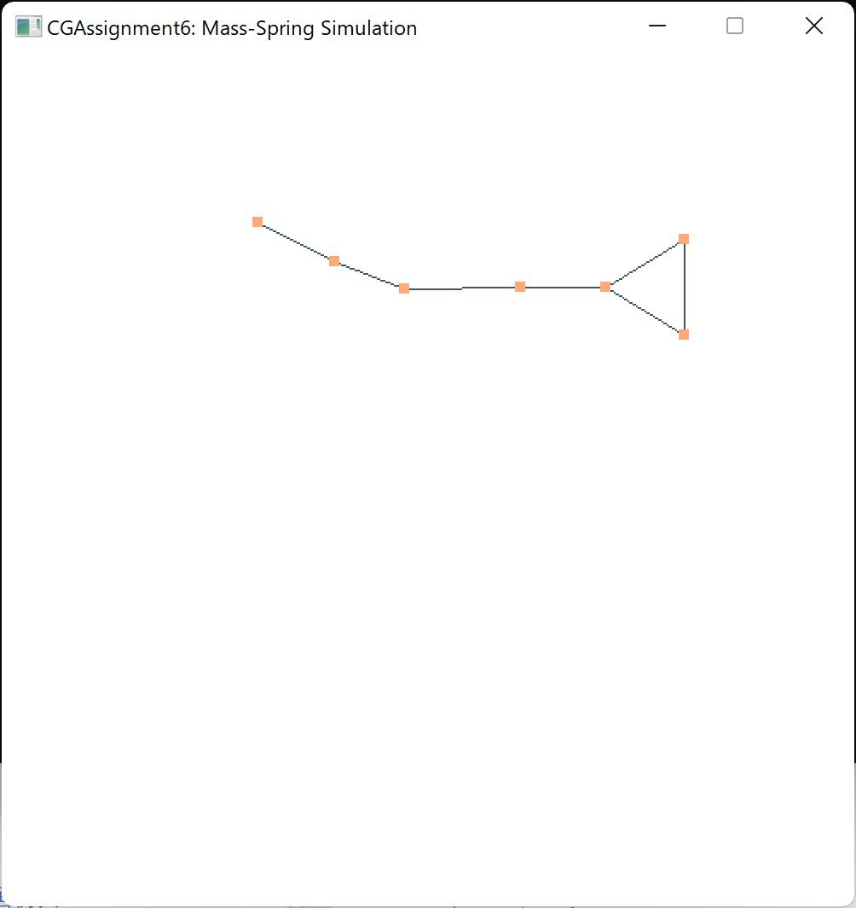

# Assignment 6: Mass-Spring Simulation
17364025 贺恩泽

## Task 1. 显式积分法实现质点弹簧系统动画仿真
根据牛顿第二定律 $F=ma$，只需求出合力 $F$ 便能得到加速度，进而积分得到速度和位移。

首先保存目前已经计算出的速度 $v$：

```cpp
std::vector<glm::vec2> m_v_prev(m_v);
```

对于两点 $i$ 和 $j$ 之间的作用力 $f_{ij}$，有：

$$ f_{ij}=-k(\sqrt{x_i-x_j}-l_{ij})(\frac{x_i-x_j}{||x_i-x_j||}) $$

加上重力即为合力 $F$，实现代码如下：

```cpp
for (unsigned int i = 0; i < m_numParticles; ++i)
{
    // 重力
    glm::vec2 force = gravity * m_particleMass;
    for (unsigned int j = 0; j < m_numParticles; ++j)
    {
        // 跳过不相连的点或者自己
        if (i == j || m_restLength[i][j] == 0) continue;
        // 加上弹力
        force += -m_stiffness * 
            (glm::length(m_x[i] - m_x[j]) - m_restLength[i][j]) * 
            glm::normalize(m_x[i] - m_x[j]);
    }
}
```

进而得到加速度，并利用如下方法积分计算出速度和位移：

$$ v_{t+1}=v_t+\Delta t\frac{f_t}{m} $$
$$ x_{t+1}=x_t+\Delta tv_t $$

实现代码如下：

```cpp
m_v[i] += dt * force / m_particleMass;
```

然后计算位移：

```cpp
for (unsigned int i = 1; i < m_numParticles; ++i)
{
    // 使用 v(t) 而不是 v(t+1)
    m_x[i] += dt * m_v_prev[i];
}
```

得到如下效果：



随后出现较大动荡：


## Task 2. 半隐式积分法实现质点弹簧系统动画仿真

采用 $x_{t+1}=x_t+\Delta tv_{t+1}$ 来计算位移，将计算位移的代码变更为以下即可：

```cpp
m_x[i] += dt * m_v[i];
```

得到如下效果：


虽然也有动荡，但是相较显式积分法的结果更为稳定：


## Task 3. 利用阻尼系数衰减

利用阻尼系数对速度进行衰减：

```cpp
m_v[i] *= glm::exp(-dt * m_damping);
```

得到如下效果：


随后逐渐稳定下来：


## Task 4. 修改弹簧刚度系数
- 刚度系数 80
  
    
- 刚度系数 800
  
    
- 刚度系数 8000
  
    
- 刚度系数 80000
  
    

可以看到，随着刚度系数 $k$ 的增加，弹簧所能被拉扯的限度逐渐减小。刚性系数越大，则弹簧抗形变越强，越难被拉长或压短；刚性系数越小，则弹簧抗形变越弱，越容易被拉长或压短。
